

   
  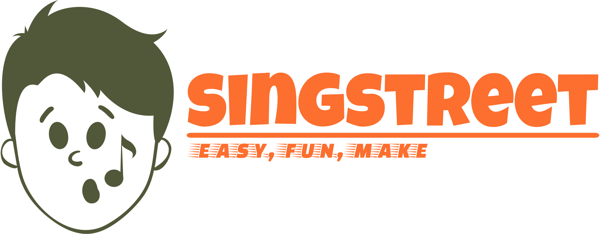
   

 <h3><b>SingStreet</b></h3>
 노래합작을 위한 롤플레잉형 커뮤니티 플랫폼  
 
  삼성 청년 SW 아카데미</b>  
  2023.07.10 ~ 2023.08.18
   
  <a href="https://www.youtube.com/watch?v=68NI0eekCIo"> 
     
    UCC 보러가기
  </a>

# 👨‍👩‍👧‍👦 멤버

<table>
    <tr>
        <td height="140px" align="center"> <a href="https://github.com/LEEBUMBAE">
                👑 강현곤  (Front-End) </a>  </td>
        <td height="140px" align="center"> <a href="https://github.com/nevermindperil">
                🌊 송원규  (Front-End) </a>  </td>
        <td height="140px" align="center"> <a href="https://github.com/c0mmedes">
                🔥 이대경  (Back-End) </a>  </td>
        <td height="140px" align="center"> <a href="https://github.com/LeeSW-k">
                🌞 이상욱  (Back-End) </a>  </td>
        <td height="140px" align="center"> <a href="https://github.com/human3452">
                👻 이준혁  (Back-End) </a>  </td>
    </tr>
</table>

 

# ⚙️ 아키텍쳐 및 기술 소개

<table>
    <tr>
        <td><b>Back-end</b></td>
        <td>
            
            
            
            
            
            
            
            
        </td>
    </tr>
    <tr>
        <td><b>Front-end</b></td>
        <td>
            
            
            
        </td>
    </tr>
    <tr>
        <td><b>Infra</b></td>
        <td>
            
            
            
            
            
            
        </td>
    </tr>
    <tr>
        <td><b>library ,API</b></td>
        <td>
            
              
        </td>
    </tr>
    <tr>
        <td><b>VC</b></td>
        <td>
            
            
            
              
        </td>
    </tr>
    <tr>
        <td><b>Tools</b></td>
        <td>
            
            
            
            </a>
        </td>
    </tr>
</table>

 

# 🪓 시스템 아키텍처
  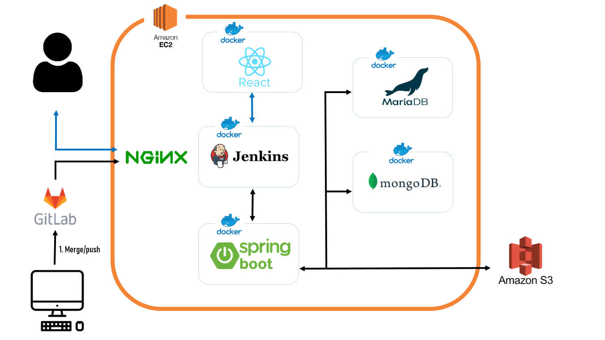 
 

# 📚 ERD
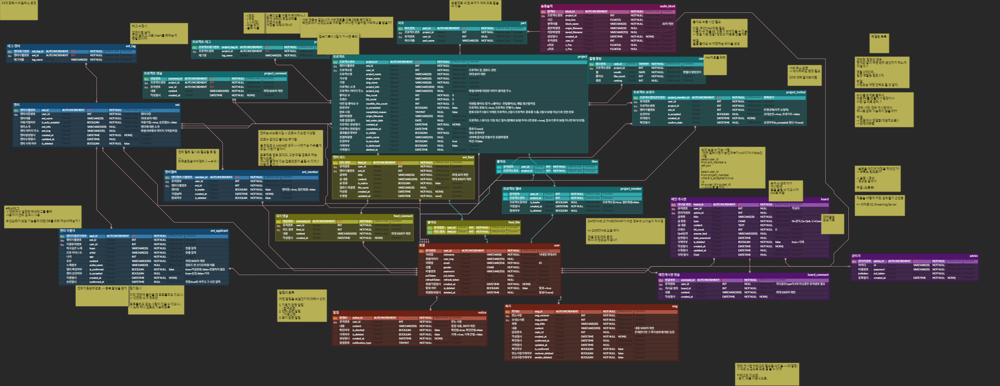 
 

# 💻 기능 소개

### 엔터 메인 페이지
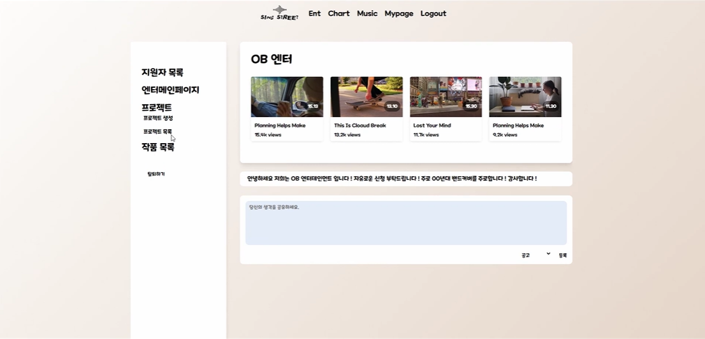 
* 엔터내 피드를 통하여 글을 작성할 수 있고 엔터 내 작품들을 확인할 수 있습니다.
  

### 엔터 생성
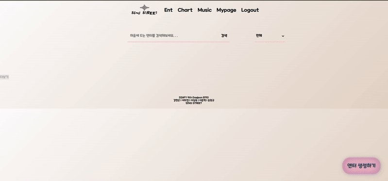 
* 엔터명, 엔터소개, 해시태그, 공개여부, 엔터 프로필을 입력받고 엔터를 생성할 수 있습니다.
 

### 엔터 지원하기 
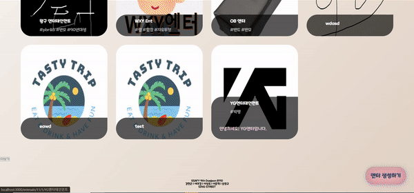 
* 엔터 목록 페이지에서 엔터에 들어간 후 지원하기 버튼을 누른 후 나이, 선호 아티스트, 하고싶은 노래, 포부, 자신의 포트폴리오를 올려 지원할 수 있습니다.
 

### 엔터 수락하기
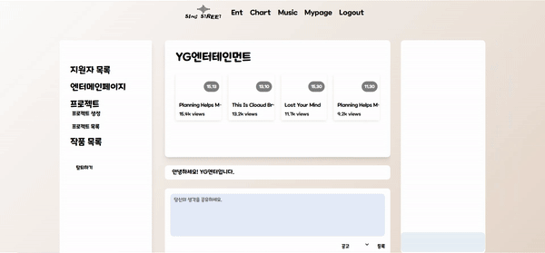 
* 엔터장은 엔터 페이지에서 지원자 목록을 확인 후 수락 혹은 거절을 선택할 수 있습니다.
 

### 엔터 내 피드 작성
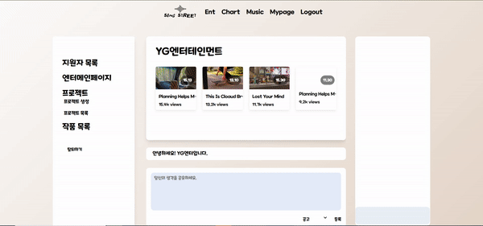 
* 가입된 엔터 페이지에서 피드에 글을 작성할 수 있습니다.
 

### 엔터 내 프로젝트 생성
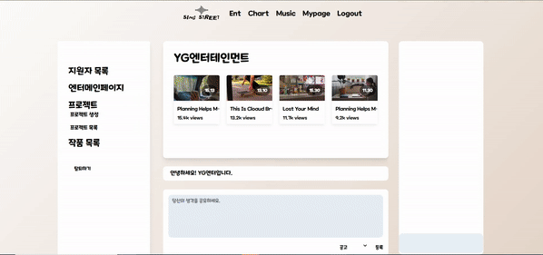 
* 가입된 엔터 페이지에서 프로젝트명, 프로젝트소개, 곡, 가수, 해시태그, 모집여부, 공개여부, 가수 파트를 설정하여 생성할 수 있습니다.
 

### 프로젝트 멤버 초대
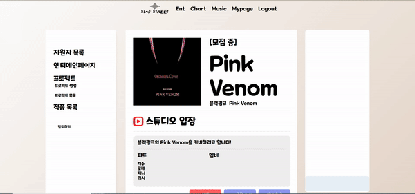 
* 프로젝트장은 가입된 엔터 내의 멤버들을 프로젝트에 초대할 수 있습니다.
 

### 프로젝트 멤버 파트 부여
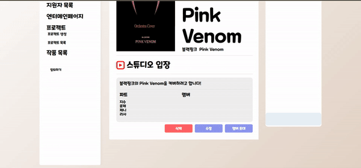 
* 프로젝트장은 프로젝트 스튜디오에 입장하기 전 수정버튼으로 초대된 멤버들에게 파트를 부여할 수 있습니다.
 

### 랭킹 페이지
 
* 유저들이 올린 작품에 대한 저번 달의 좋아요 수를 바탕으로 랭킹을 집계하고 그 순위별로 화면에 표시합니다.
 

### 음원 공동 편집
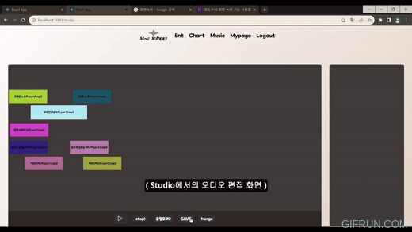 
* 프로젝트에 초대된 멤버들은 스튜디오에 입장하여 자신의 음원블록을 업로드 후 함께 구간에 맞게 블럭을 쌓는 방식으로 편집을 진행하고 저장할 수 있습니다. 
 
 
